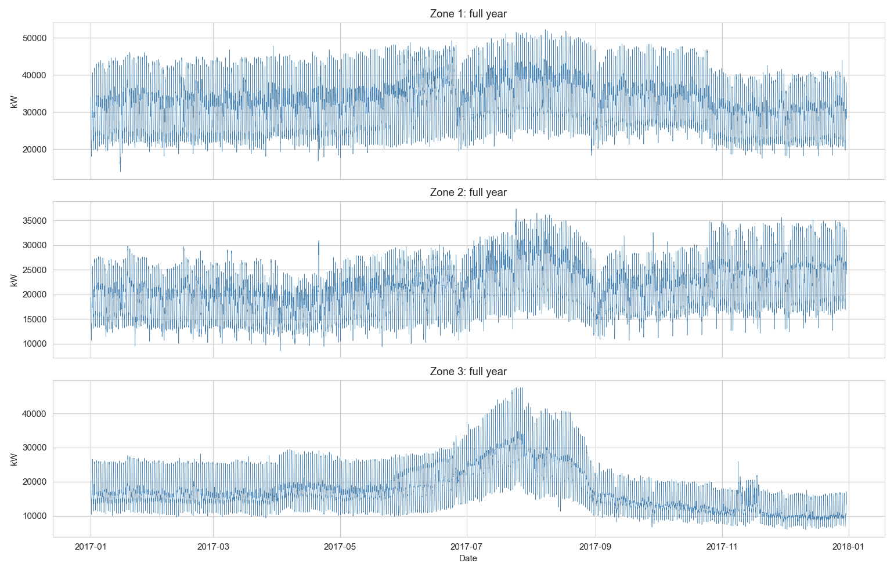
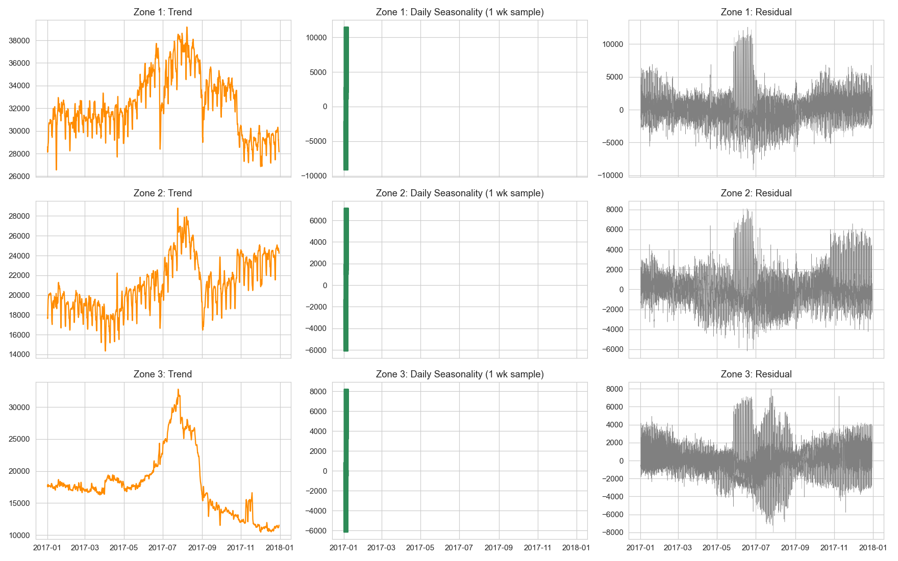
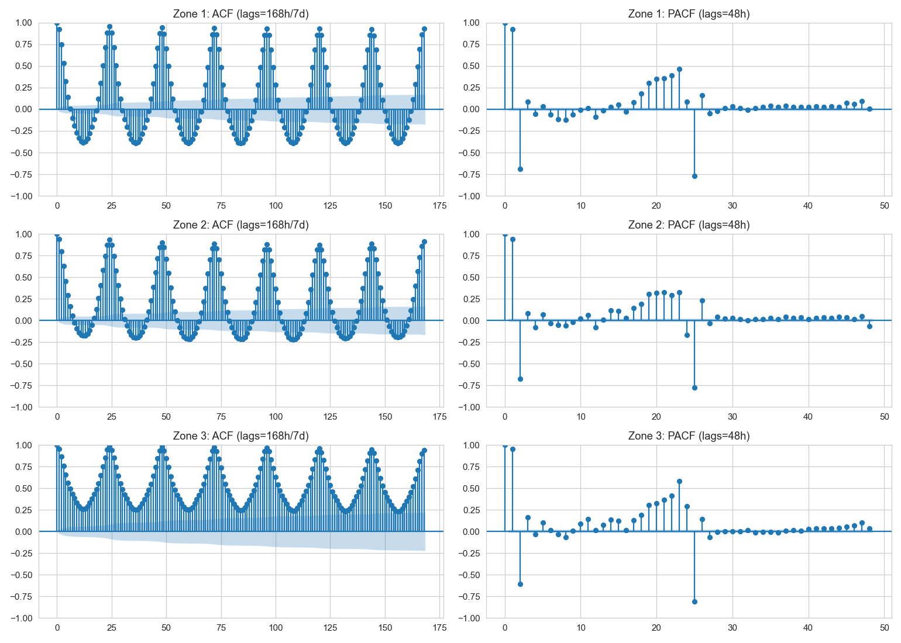
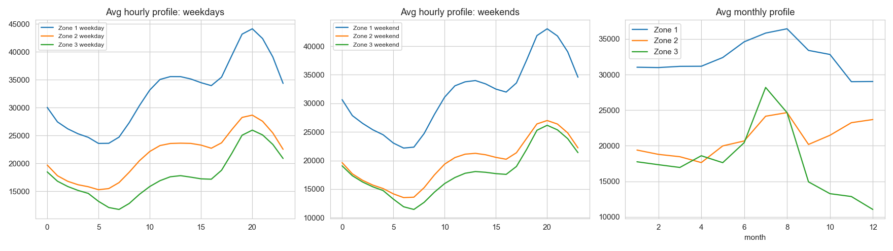
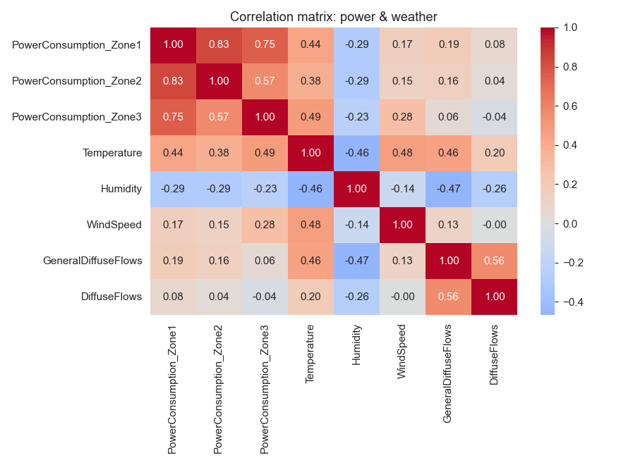
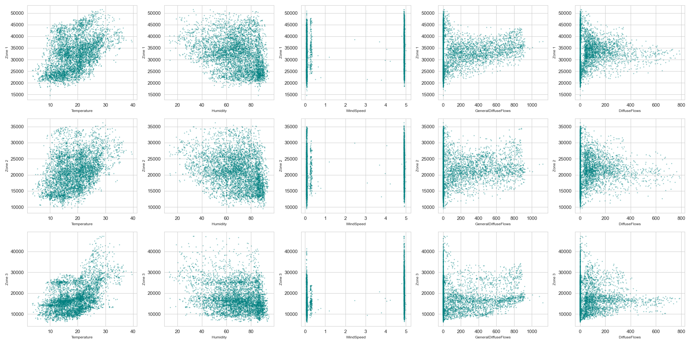
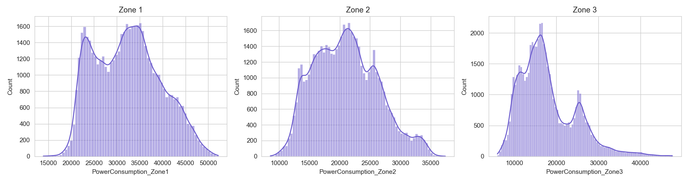
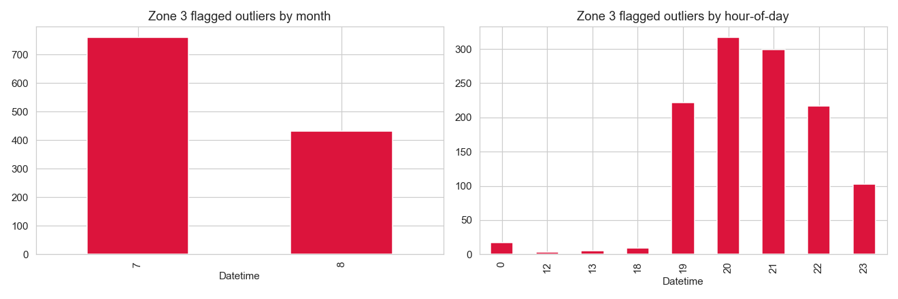

# EDA Report

Generated by `src/eda.py` from `data\processed\cleaned_energy_data.csv`.

## A. Time-series structure

### Seasonal decomposition (daily period=24h)
- Zone 1: daily seasonal amplitude = 20634.2 kW, residual std = 2181.3
- Zone 2: daily seasonal amplitude = 13247.1 kW, residual std = 1651.8
- Zone 3: daily seasonal amplitude = 14376.2 kW, residual std = 1768.6

### Stationarity (Augmented Dickey-Fuller test, hourly series)
- Zone 1: ADF stat=-4.45, p-value=0.0002 -> stationary
- Zone 2: ADF stat=-4.69, p-value=0.0001 -> stationary
- Zone 3: ADF stat=-1.26, p-value=0.6467 -> NOT stationary

### Daily peak/trough hours
- Zone 1: peak hour=20:00, trough hour=6:00
- Zone 2: peak hour=20:00, trough hour=6:00
- Zone 3: peak hour=20:00, trough hour=7:00

## B. Weather relationships

- Zone 1 top correlated weather vars: Temperature=0.44, Humidity=-0.287, GeneralDiffuseFlows=0.188
- Zone 2 top correlated weather vars: Temperature=0.382, Humidity=-0.295, GeneralDiffuseFlows=0.157
- Zone 3 top correlated weather vars: Temperature=0.49, WindSpeed=0.279, Humidity=-0.233

## Zone 3 outlier location (from the flagged column, informational only)

- Total flagged: 1191 (2.27% of rows)
- By month: {7: 760, 8: 431}
- By hour: {0: 17, 12: 3, 13: 5, 18: 9, 19: 222, 20: 317, 21: 299, 22: 217, 23: 102}

## C. Cross-zone correlation (power vs power)

|        |   Zone 1 |   Zone 2 |   Zone 3 |
|:-------|---------:|---------:|---------:|
| Zone 1 |    1     |    0.835 |    0.751 |
| Zone 2 |    0.835 |    1     |    0.571 |
| Zone 3 |    0.751 |    0.571 |    1     |