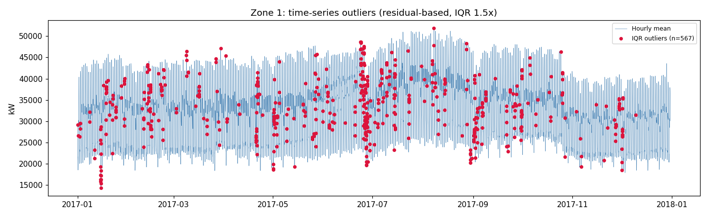
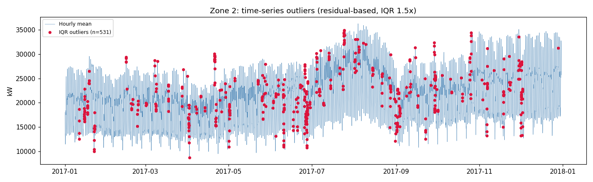
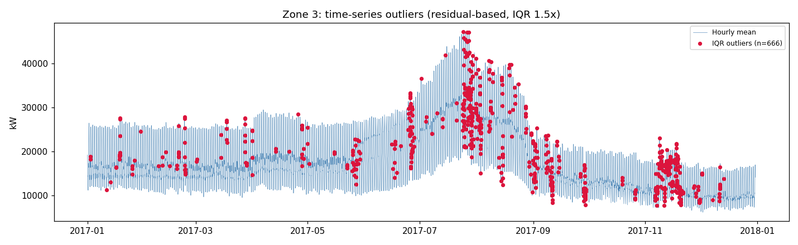
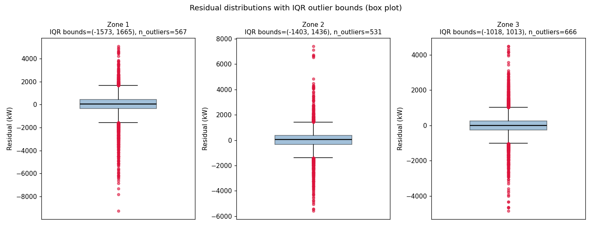
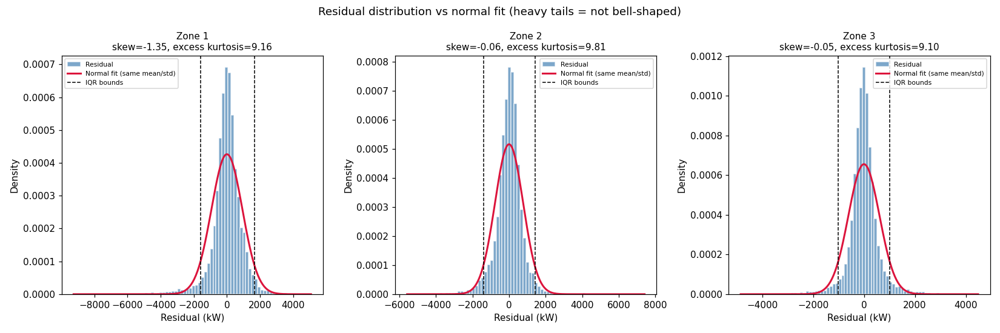

# Time-Series Outlier Detection Report

Method: MSTL decomposition (daily period=24h, weekly period=168h) per zone, then outliers flagged on the **residual** (value with trend + daily + weekly seasonality removed) using IQR (1.5x Tukey fence) alone. Residuals were checked for normality and found strongly heavy-tailed (excess kurtosis ~9-10, D'Agostino-Pearson p~0 for all 3 zones), so Z-score (which assumes normality and is prone to masking by extreme values inflating std) was dropped in favor of IQR alone.

## Zone 1
- Flagged (residual-based IQR): 567 hours (6.49%) vs naive global-IQR-on-raw-value: 0 rows (10-min resolution)
- Residual IQR bounds: (-1572.7, 1665.0)
- Flagged by month: {1: 55, 2: 45, 3: 28, 4: 32, 5: 61, 6: 114, 7: 57, 8: 39, 9: 81, 10: 21, 11: 21, 12: 13}
- Flagged by hour: {0: 12, 1: 8, 2: 14, 3: 9, 4: 4, 5: 4, 6: 9, 7: 15, 8: 27, 9: 36, 10: 53, 11: 46, 12: 43, 13: 34, 14: 32, 15: 27, 16: 29, 17: 36, 18: 32, 19: 30, 20: 23, 21: 18, 22: 12, 23: 14}

## Zone 2
- Flagged (residual-based IQR): 531 hours (6.08%) vs naive global-IQR-on-raw-value: 7 rows (10-min resolution)
- Residual IQR bounds: (-1403.2, 1436.4)
- Flagged by month: {1: 39, 2: 18, 3: 28, 4: 53, 5: 37, 6: 102, 7: 46, 8: 47, 9: 72, 10: 22, 11: 42, 12: 25}
- Flagged by hour: {0: 6, 1: 7, 2: 9, 3: 7, 4: 4, 5: 5, 6: 10, 7: 13, 8: 17, 9: 34, 10: 45, 11: 42, 12: 40, 13: 44, 14: 42, 15: 29, 16: 31, 17: 25, 18: 31, 19: 27, 20: 20, 21: 20, 22: 14, 23: 9}

## Zone 3
- Flagged (residual-based IQR): 666 hours (7.62%) vs naive global-IQR-on-raw-value: 1191 rows (10-min resolution)
- Residual IQR bounds: (-1017.8, 1013.0)
- Flagged by month: {1: 20, 2: 25, 3: 24, 4: 14, 5: 30, 6: 49, 7: 127, 8: 88, 9: 101, 10: 8, 11: 165, 12: 15}
- Flagged by hour: {0: 20, 1: 17, 2: 19, 3: 14, 4: 11, 5: 7, 6: 10, 7: 12, 8: 20, 9: 35, 10: 39, 11: 40, 12: 44, 13: 46, 14: 36, 15: 37, 16: 35, 17: 37, 18: 38, 19: 33, 20: 41, 21: 31, 22: 25, 23: 19}

## Residual box plots (IQR outlier bounds)

## Residual histograms (vs normal fit)

## Summary (residual-based IQR vs naive global-IQR)

| Zone | Time-series flagged (IQR on residual) | % of hours | Naive global-IQR flagged (10-min rows) |
|---|---|---|---|
| Zone 1 | 567 | 6.49% | 0 |
| Zone 2 | 531 | 6.08% | 7 |
| Zone 3 | 666 | 7.62% | 1191 |